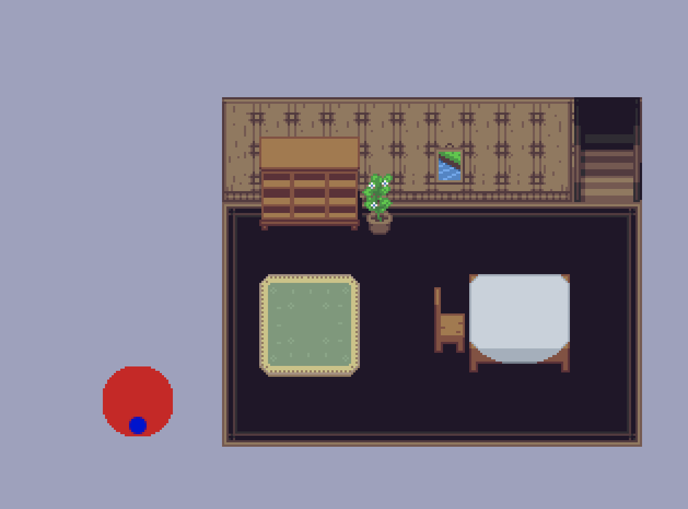

+++
title = "Experimenting with Amethyst: A Rust game engine"
author = "doomy"
template = "page.html"
date = 2019-06-10T20:05:23.927Z
description = "Playing around with Amethyst, an ECS-based game engine for the Rust programming language"

[taxonomies]
tags = ["rust", "gamedev"]

+++

It's been a while! I haven't been not-busy, but writing is effort, u kno?

Well to make up for that, I'm going to be documenting progress using & learning the Amethyst game engine.

## Amethyst

So, what is Amethyst? [It's a game engine](https://amethyst.rs/) written with the Rust programming language. I've been involved as a volunteer since winter, and I've been learning the engine itself more and more each day.

Hopefully by documenting my progress here, I can document early issues I ran into, and how to solve them.

## Game

To be honest, I don't really have that perfectly nailed down right now. My goal is to just make _something_ that I can build off of. At first, I tried a simple DDR/FFR style rhythm game. This was a great exercise, but it was so messy by the time I was done with it (probably a good sign I learned a lot).

## Starting out

Amethyst is built on `specs`, an ECS (Entity Component System). If you've used something like Unity in the past, you might be partially familiar.

I thought it'd be smooth sailing, since I _had_ used Unity in the past, and ECS was a term I was comfortable with. For the most part it was - however, Unity's "ECS" has a few distinct differences.

In Unity, when you want to write a new script, you often use `MonoBehaviour`. This file would contain a definition of the component, as well as how that individual component should behave. 

In Amethyst, we see the "S" in "ECS" more often. Instead of having a component describe its own implementation, we use Systems. While I won't go into depth about the topic since the [Amethyst book covers these topics much better than I could](https://amethyst.rs/doc), let me give you a general gist of systems.

Whereas some engines like Unity define individual implementation, systems define how _all_ things of a certain type should behave. This makes it super easy to benefit from certain CPU performance improvements later on.

## Hurdles

Okay. When I said my first game attempt in Amethyst was an FFR clone, I lied. It was actually going to be a text-based visual novel. As is often the case with game development, I planned a huuuge scope while I was still learning. Turns out this is usually not a good idea! My first lesson is don't even _pretend_ like the first few games you make while learning an engine will last. It's important to be messy, make mistakes, learn, and move on.

So that brings us to our FFR style game. The idea was to create something _much_ simpler. The game would start with a song at a constant BPM, a file would describe what "arrows" would show, and input was limited to keyboard movements. While I never attained this goal either, I actually got kind of far! If you'd like to take a look, I have the [hideous messy source code right here](https://github.com/piedoom/r). So, I got the arrows spawning according to a timer, and moving down at a constant speed. Input is also captured, although it has no outward effect on the "game".

So, why did I move on, and what did I learn? My biggest issue was figuring out which code should be put in a `Component`, and which code should be put in a `System`. For instance, if I want to move an entity with a component, I also need the entity's transform. Should a function be supplied in the component that takes a reference to a transform, or should everything be handled in the system?

To illustrate the difference, imagine the following pseudo-code:

```rs
// Component 
struct MyComponent
    speed: 1

impl MyComponent
    fn move_up(self, transform) 
        // move up the transform here using the component speed
        transform.move_up(self.speed)

// System
struct MyComponentSystem

impl MyComponentSystem
    fn run(component, transform)
        component.move_up(transform)
```

Here, we define data *and* implementation in a component. After playing around with my code, I found similarities to ECS and other common patters like MVC. Compared to MVC, components are almost like models, in that they contain data (and possibly some helper functions), but do not implement their own functionality. That is left up to the system (which is similar ((sort of)) to a controller).

So if we were to rewrite the above pseudo-code, it might look like this:

```rs
// Component 
struct MyComponent
    speed: 1

// System
struct MyComponentSystem

impl MyComponentSystem
    fn run(component, transform)
        // imagine the transform component has a translate_up function
        transform.translate_up(component.speed)
```

It does the same thing, but implementing most of the logic in a system makes it easier to keep track my project's code.

## What's Next

Now that I had working knowledge of how to use specs, I thought it was a good idea to start fresh and new. I wanted to come back to the idea of basing a game around a narrative. Unfortunately, text-based graphics - while not difficult - are not relatively popular, which means I'd have less resources from which to learn. Instead, I thought a top-down JRPG-like game might be a bit more attainable. Okay, actually JRPGs are super hard, but the movement aspect is easy.

For JRPG/Pokemon style movement, a character needs to be able to move in at least the four cardinal directions, align itself to a grid, and not run through walls.  This is *much* simpler than attempting something like a platformer which gets hairy for someone with a BFA, especially when slopes are involved. I'm a horror fan, and I think there's a criminal lack of 2D horror - so I've decided to make an RPG-like horror game. Fun stuff!

## Movement

Okay, so lets remember the 3 goals from earlier:

1. Move in four directions
2. Align to a grid
3. Don't run through walls

I have a solid 2 / 3 so far, which I think is pretty good! My character runs around in an endless cornflower-blue void, but it's a start.

### 1. Move in four directions

To start, I needed a way to move the character. Sometimes, just modifying a transform in a system would suffice, but in my case, I knew I had more advanced movement in the future, so I opted for custom components. I created two, actually - `Movement`, and `Player`. This way, I can re-use my movement component with NPCs and other game entities without it being tied to game input. Instead, my `Player` component and system capture user input, and modify a `Movement` state. The movement system *then* moves everything based on the component's state. 

Again, as someone whose degree includes the word "Art", math is not my forte. I actually regret not paying attention in my classes. Ever hear people say "when will I ever use this?" in class? Well, you will use it. Probably a lot. At least if you are an aspiring game developer.

However, I watched a few videos on vectors and all that cool stuff, so I got a #solid grasp on some concepts. This helped a lot when figuring out how to keep the direction state in my `Movement` component.

Usually, I would do something like this to store direction:

```rs
struct Movement
    up: bool
    down: bool
    left: bool
    right: bool
```

While not totally awful (maybe a little awful), it is not ideal, especially when dealing with vector math later down the road. Instead, the nalgebra math crate provides me with a `Vector3`, and a `Unit` type.

From my light reading, I realized I could store the direction of my `Movement` in a unit vector.

```rs
struct Movment
    direction: Unit<Vector3>
```

This makes it super-duper simple to actually use this value later on in tandem with the entity transform.

### 2. Align to a grid

This one was much tougher for me! I had a few ideas on how to implement grid-based movement. Initially, I just `lerp`ed between two values via the `Movement` component. This is great for entities that only move one grid at a time. However, for entities that move multiple tiles in one direction, this method looked unstable and jittery. Controls also felt unresponsive sometimes.

Instead, I figured that I only really care if the entity is aligned to a grid *before* and *after* it stops moving. In-between, it can just y'know, go. I haven't implemented this yet, but it should allow for smoother movement and tighter-feeling controls. 

### 3. Don't run through walls

This is the hardest part, in my mind. It should be decently simple - since all items are aligned to a grid, all we would need to do is check if the tile next to the player is empty. However, this (possibly) gets into ray-casting which I'm unfamiliar with using Amethyst. But I hope to learn!

## End

All said, while I did struggle a bit with the initial complexity, Amethyst is an insanely fun engine to work with, even if all you're doing is making sprites move around. Specs is very powerful, and the "composition over inheritance" style of coding makes development go much quicker than I expected.

I hope to have more stuff like this in the future! Please consider [donating](https://amethyst.rs/donate/) to the Amethyst Foundation to support development.

---

Last week I took a deep dive into Amethyst, and learned as much as I could in a week. I figured out systems, got a player moving with input, and created a component for grid-aligned movement. As a quick update, let's talk about the movement system:

## Review

In the previous issue, I created both a `GridMovement` component, as well as a `Movement` component. The latter was free-er and not aligned to a grid like the former. In the future if I were to redesign this, I would create one single movement component, as well as a `GridAligned` component. Because grid calculations are significantly different than simple free-moving calculations, this separate component would keep the necessary data to feed into the regular movement component. Alternatively, an "align to grid" boolean option on a `Movement` component could prove to be a simpler solution.

## This week

This week was all about maps! Specifically, [Tiled](https://www.mapeditor.org/) - a 2D tilemap editor with a wide array of supported game engines. Tiled encodes its data in XML, which is convenient since it means a custom parser doesn't need to be implemented. 

## Tiled

Rust actually has a crate for Tiled, called [`rs-tiled`](https://github.com/mattyhall/rs-tiled). It's somewhat barebones, but provides everything I needed to get started. (Well, almost everything, but more on that later.) There's also a great beginner example of how to use `rs-tiled` within Amethyst, [which you can view here](https://github.com/Temeez/Tiled-Amethyst-Example).  

There's a few limitations with the above:

1. The tilemap is not loaded as an asset, as a spritesheet or model would be. This means it's quick and easy to load via our world, but can pose some issues later on if we want to read our map data in other systems. 
2. The example only loads a single layer, which is too basic for a JRPG-style game. We will eventually want not only a background layer, but a scenery layer.

I sought out to create an asset type from `rs-tiled` according to the guide [available here](https://book.amethyst.rs/master/assets/how_to_define_custom_assets.html). It's relatively straightforward, especially since `rs-tiled` provides a method to read from bytes. 

Not exactly Amethyst related, but I dislike when Rust projects try to put too much in a single file.While I'm grateful that `rs-tiled` exists, all of the code was in a single `lib.rs` file which made understanding it rather difficult. Additionally, the code was not Rust 2018 idiomatic, mostly because it used the `try!` macro instead of the preferred `?` for `Result`s.

[To remedy this, I created my own fork of `rs-tiled`](https://github.com/piedoom/rs-tiled), which updates the code so newer `rustc` won't complain. I also added an `amethyst` feature gate that enables `Map` to be an asset. This worked pretty great, actually! I'm not sure if including the asset type within the crate is idiomatic, but once that is reviewed I might muster up the courage to PR into master - though depending on the original author's intentions they may not like my very subjective splitting up of source files.

## Building the Map

This was the _really_ tough part for me. Now that I had a `Map` asset, how do I use it? My first thought was "Oh, well, a handle is just like a reference, right? All I have to do is dereference that handle somehow to get the underlying asset! Easy."

Okay, so let's try it. In Amethyst, we get the underlying asset of a `Handle` like this:

```rs
asset_storage.get(&self.my_handle.clone()).unwrap();
```

Annnnd... it panics! But why?

`Handle`s are returned _immediately_ from a `load` method, as to not block the game thread. This means that the `Handle` could point to data that is not yet fully loaded. When we try to get this incomplete data, the program panics.

While I struggled for a while to understand this concept, it's relatively easy in retrospect. The solution to make sure that everything is loaded before continuing. We can do this with `ProgressCounter`s and states. 

From a high level, our program flow looks like this:

```
Game Start ->
Begin Loading State ->
    Load Map
    Every Update, check if Map is loaded
    If loaded, push new state with Map handle
Push Main Game State ->
    Main Game State has Map handle field
    This handle is guaranteed to be fully loaded
```

Actually not too bad! This has the benefit of accidentally creating a nice loading state for us to use in our game. 

If you want to see the full details of how I actually did this, [take a look at my code here](https://github.com/piedoom/j/blob/master/src/states/load.rs#L20). Note that I actually use a couple loading states, since my map file contains references to textures that need to be loaded.

Awesome. Our map is loaded and ready to use. All that's left is to build it. To do this, I used Temeez's aforementioned [Amethyst-Tiled](https://github.com/Temeez/Tiled-Amethyst-Example) example as a base. Every tile in this case is a separate entity. While that might seem like a lot, entities in Amethyst are extremely cheap, so there's not much to worry about performance wise.

### System Data

Systems, as we know, are designed to manage the behavior of a lot of _things_ every game update. While we need functionality similar to this, our map building function only needs to run _once_, which makes running the code in the `on_start` of a game state more fitting. We can get the best of both worlds by using `world.exec` in our game state with system data. 

I'm by no means an expert `borrowck` charmer, so I may have made newbie errors, but using `SystemData` instead of a bunch of method calls on `world` helped me avoid a lot of borrow check issues. I won't get into the weeds, [but here's the code again if you're interested](https://github.com/piedoom/j/blob/master/src/states/main.rs#L35). Take note that building the map would probably be more suitable to be done in yet another loading state.

## Wrapping Up

Great! We have a way to read our tiled file, a state to load all its resources, and then a main state to actually build the tilemap and run the game. And just like that, my blobby red player sprite is no longer drifting in an endless blue void.



## Next Up

I'll be honest, this learning experience took a lot out of me. I might take a small break to a small non-tilemap-based program for a bit, but after that my next goal is collision. There's already an nphysics integration for Amethyst, and I'm excited to try it out! Until next time.

---

This week, I worked on something new for a change of pace. 

<video width="100%" controls>
    <source src="fixed.mp4" type="video/mp4">
    Your browser does not support the video tag.
</video>

# New Things

Yeah, I know. *Another* new thing. It's fine though, I'm not too attached. This is all about learning, and I'm going to continue to try.

I wanted to create a asteroids-style movement game based roughly on the base building mechanics of my favorite MMO growing up, [Star Sonata](https://www.starsonata.com/).

This game has different ships, which can be customized with different engines, radars, weapons, and more. Sounds like a great opportunity to learn about prefabs, right?

# Prefabs

Well, I finally did it! I delved into prefabs. They are unfortunately one of the more confusing and complex parts of Amethyst. Once you get the hang of them, though, they aren't too bad. However, this area is definitely one where Amethyst can improve (and it should improve once [Atelier Assets](https://github.com/amethyst/atelier-assets) lands).

## A short explaination
Prefab data is just a struct with a ton of optional fields. This is really the only important part of prefabs, the rest is (again, unfortunately) boilerplate.

An example prefab definition: 

```rs
#[derive(Deserialize, Serialize, PrefabData)]
#[serde(deny_unknown_fields)]
pub struct EntityPrefabData {
    pub name: Option<Named>,
    mesh: Option<MeshPrefab<GenMeshVertex>>,
    material: Option<MaterialPrefab>,
    gltf: Option<AssetPrefab<GltfSceneAsset, GltfSceneFormat>>,
    camera: Option<CameraPrefab>,
    transform: Option<Transform>,
    light: Option<LightPrefab>,
    player: Option<c::Player>,
    controller: Option<c::Controller>,
}
```

So why the options? Well, currently there is a limitation where multiple prefab definitions in a `ron` file must have homogenous data (though it's gotten [some improvements](https://github.com/amethyst/amethyst/pull/1625) since I started).

## Making prefabs useful

I heavily stole from Amethyst's showcase project, [Evoli](https://github.com/amethyst/evoli) - specifically its [prefab resource](https://github.com/amethyst/evoli/blob/master/src/resources/prefabs.rs). This code inserts all prefabs in a given folder into a hashmap, and then inserts itself as a resource. That lets us in turn build more data-driven games.

# Movement

My movement is... O.K. It turns out that Asteroids-style thrust movement isn't as easy as it would seem, especially when all resources on the internet talk about how to do so using a physics system, which I wanted to avoid for now.

However, I came up with a decent interim solution. 

```rs
// rotate based on unit points
transform.append_rotation_z_axis(
    // This will orient the rotation direction correctly
    controller.rotation_control *
    // Multiply by our turn speed, which is just a multiplier.
    Float::from(controller.turn_speed) *
    // Finally, multiply everything by our delta to keep consistent across framerates
    Float::from(time.delta_seconds()),
);

// Set thrust and velocity

// this gets our facing direction
let rotation = transform.isometry().inverse().rotation.to_homogeneous();
let direction = Unit::new_unchecked(Vector3::new(rotation.row(UP)[0], rotation.row(UP)[1], Float::from(0.)));

// If our input is 0, we're not changing our velocity.
if controller.thrust_control != Float::from(0.) {
    controller.velocity = Unit::new_normalize(
        controller.velocity.as_ref() + direction.scale(controller.thrust_control * controller.acceleration));
}


// Finally, actually transform, multiplying by our max speed and delta
transform.prepend_translation(
    controller
        .velocity
        .scale(controller.max_speed * Float::from(time.delta_seconds())),
);
```

You can see the whole thing [in context here](https://github.com/piedoom/s/blob/master/src/systems/controller.rs). Please note this is by no means a very good solution, and I've already run into some issues with it cutting off important data.

# 3D Rendering

This part is actually pretty easy. Again, I stole a bunch of code from the Rendy example, and then modified it to only provide the PBR pass (or so I think). You can see what I have so far at the top! It's rendering a plane, so it doesn't look 3D, but trust me - it is. 

# Next Week

Next, I'm hoping to do more with modeling practice, as well as figuring out prefabs better. See you there!